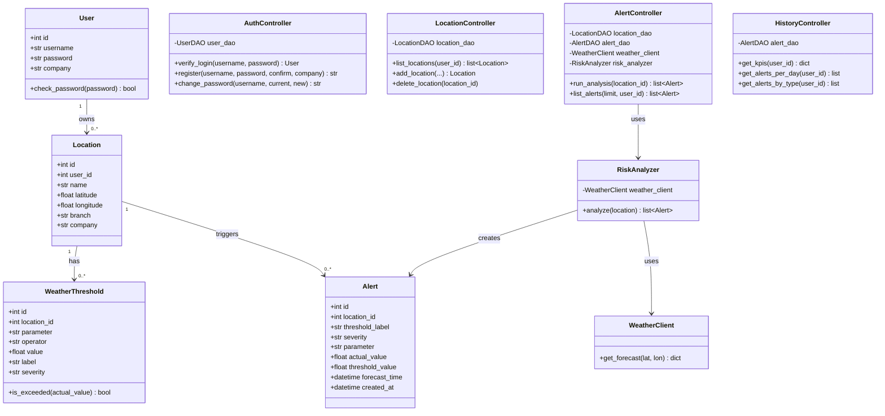
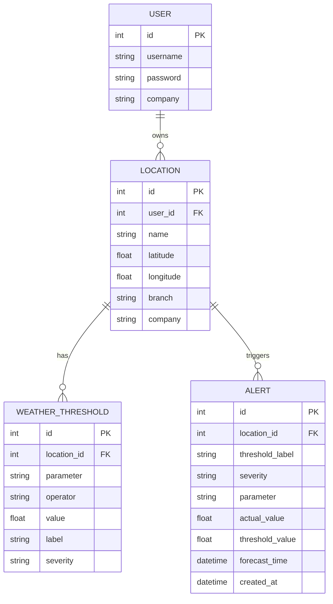

# WeatherGuard

A B2B planning tool for companies in weather-dependent industries — construction, event logistics, and delivery services. Firms register their sites and get automatic alerts when critical weather conditions are forecast at their locations.

Built with Python, NiceGUI, SQLite (via SQLModel ORM), the Open-Meteo weather API, and the Leaflet.js map library.

---

## The Problem

Outdoor teams — crane operators, concrete crews, event builders — lose time and money when weather hits unexpectedly. WeatherGuard monitors forecasts against company-defined thresholds and alerts before conditions become critical, enabling active risk management instead of reactive damage control.

---

## User Stories

| # | As a... | I want to... | So that... |
|---|---|---|---|
| 1 | operations manager | register company locations and construction sites | I can monitor all of them in one place |
| 2 | operations manager | define custom weather thresholds per location (e.g. frost < 2°C, wind > 40 km/h) | alerts match the specific requirements of each job |
| 3 | operations manager | see a live dashboard with all locations and their current risk status | I get an immediate overview without checking each site manually |
| 4 | field team lead | receive a wind alert before crane or tent operations | I can halt or reschedule in time |
| 5 | field team lead | receive a frost alert before concrete is poured | I can protect the pour or adjust the schedule |
| 6 | field team lead | receive a rain alert during heavy precipitation | I can protect materials or postpone outdoor work |
| 7 | operations manager | review a history of past alerts per location | I can document incidents and improve future planning |
| 8 | operations manager | pick a location on an interactive map instead of entering coordinates manually | I can add sites faster and without errors |
| 9 | user | log in with my own account | my locations and alerts are separate from other companies |
| 10 | operations manager | see charts of alert frequency and type in the history view | I can spot patterns and identify high-risk periods |

---

## Class Diagram



---

## ER-Diagramm



---

## Architecture

```
NiceGUI Frontend (Browser)
        │
        ├── Leaflet.js Map  →  user picks coordinates by clicking or searching
        │
        ▼
Pages (ui/pages.py) — five routes: /, /app, /dashboard, /reports, /settings
        │
        ▼
Controllers (ui/controllers.py) — Auth, Location, Alert, History
        │
        ├── Services (services/) → WeatherClient, RiskAnalyzer → Open-Meteo API
        │
        ▼
DAOs (data_access/dao.py) — UserDAO, LocationDAO, AlertDAO
        │
        ▼
SQLite Database (via SQLModel ORM)
        ├── User
        ├── Location
        ├── WeatherThreshold
        └── Alert
```

---

## APIs Used

| API | Purpose | Cost | Key required |
|-----|---------|------|--------------|
| [Open-Meteo](https://open-meteo.com) | 3-day hourly weather forecast (temperature, wind, gusts, rain, snow, humidity) | Free | No |
| [Nominatim / OpenStreetMap](https://nominatim.openstreetmap.org) | Geocoding — converts place names to coordinates | Free | No |
| [Leaflet.js](https://leafletjs.com) | Interactive map with clickable marker for location picking | Free | No |

---

## Project Structure

```
WeatherGuard/
├── main.py                    # Entrypoint — python main.py
├── __main__.py                # Alternative entrypoint — python -m weatherguard
├── application.py             # WeatherGuardApplication — wires everything together
├── config.py                  # Settings (DATABASE_URL)
├── requirements.txt
├── weatherguard.db            # SQLite database (auto-seeded on first run)
│
├── domain/
│   └── models.py              # SQLModel tables: User, Location, WeatherThreshold, Alert
│
├── data_access/
│   ├── db.py                  # Database class (engine + sessions)
│   ├── dao.py                 # UserDAO, LocationDAO, AlertDAO — all CRUD
│   └── seed.py                # WeatherSeeder — demo data on first run
│
├── services/
│   ├── weather_client.py      # WeatherClient — Open-Meteo API wrapper
│   └── risk_analyzer.py       # RiskAnalyzer — threshold checks & alert creation
│
└── ui/
    ├── controllers.py         # AuthController, LocationController, AlertController, HistoryController
    ├── dashboard_refresh.py   # DashboardRefresh — auto-refresh every 3 minutes
    └── pages.py               # Pages class — registers all NiceGUI routes
```

---

## OOP Concepts Used

| Concept | Where |
|---------|-------|
| **Classes & Objects** | `User`, `Location`, `WeatherThreshold`, `Alert`, `WeatherClient`, `RiskAnalyzer`, all DAOs and Controllers |
| **Encapsulation** | `threshold.is_exceeded(value)` and `user.check_password(pw)` hide the comparison logic inside the class |
| **Relationships / Associations** | A `Location` has many `WeatherThreshold`s, each `Alert` belongs to one `Location` |
| **Separation of concerns** | `domain/` (data), `data_access/` (DB), `services/` (logic), `ui/` (presentation) are in separate folders |
| **DRY (don't repeat yourself)** | The sidebar, KPI row, and chart helpers are defined once in `pages.py` and reused across all pages |

---

## Setup

```bash
git clone https://github.com/xynabil/WeatherGuard.git
cd WeatherGuard
pip install -r requirements.txt
python main.py
# Open http://localhost:8080
```

The database (`weatherguard.db`) is included in the repo and already contains demo data — no setup needed.

---

## Demo Login

| Username | Password |
|----------|----------|
| `admin`  | `admin123` |

---

## Demo Data

The seeded database includes:

| Location | Branch | Example Thresholds |
|----------|------|--------------------|
| Baustelle Zürich HB | Bau | Frost < 5°C, Sturm > 60 km/h, Starkregen > 10 mm |
| Open-Air Bühne Olten | Event | Sturm > 40 km/h, Regen > 5 mm, Frost < 0°C |
| Depot Basel Süd | Lieferdienst | Schneefall > 5 cm, Orkan > 70 km/h, Extremkälte < -5°C |

10 historical alerts are spread across the last 7 days so charts and history are visible immediately after cloning.
