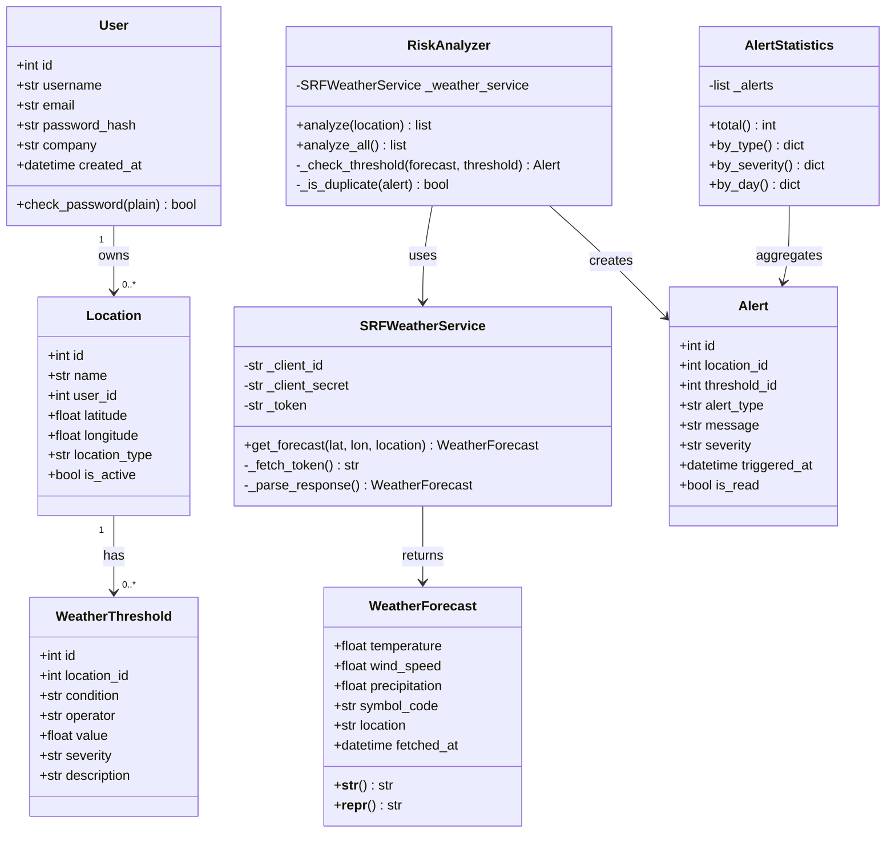

# WeatherGuard

A B2B planning tool for companies in weather-dependent industries — construction, event logistics, and delivery services. Firms register their sites and get automatic alerts when critical weather conditions are forecast at their locations.

Built with Python, NiceGUI, SQLite (via SQLModel ORM), the SRF Meteo API v2 (SRG SSR Developer Portal), and the Leaflet.js map library.

---

## The Problem

Outdoor teams — crane operators, concrete crews, event builders — lose time and money when weather hits unexpectedly. WeatherGuard monitors forecasts against company-defined thresholds and alerts before conditions become critical, enabling active risk management instead of reactive damage control.

---

## User Stories

| # | As a... | I want to... | So that... |
|---|---|---|---|
| 1 | operations manager | register company locations and construction sites | I can monitor all of them in one place |
| 2 | operations manager | define custom weather thresholds per location (e.g. frost < 2°C, wind > 40 km/h) | alerts match the specific requirements of each job |
| 3 | operations manager | see a live dashboard with all locations and their current risk status | I get an immediate overview without checking each site manually |
| 4 | field team lead | receive a wind alert before crane or tent operations | I can halt or reschedule in time |
| 5 | field team lead | receive a frost alert before concrete is poured | I can protect the pour or adjust the schedule |
| 6 | field team lead | receive a rain alert during heavy precipitation | I can protect materials or postpone outdoor work |
| 7 | operations manager | review a history of past alerts per location | I can document incidents and improve future planning |
| 8 | operations manager | pick a location on an interactive map instead of entering coordinates manually | I can add sites faster and without errors |
| 9 | user | log in with my own account | my locations and alerts are separate from other companies |
| 10 | operations manager | see charts of alert frequency and type in the history view | I can spot patterns and identify high-risk periods |

---

## Data Types, Inputs & Expected Outputs

### User (input)

| Field | Type | Example |
|---|---|---|
| `id` | `int` | `1` |
| `username` | `str` | `"m.mueller"` |
| `email` | `str` | `"m.mueller@muellerba.ch"` |
| `password_hash` | `str` | `"$2b$12$..."` |
| `company` | `str` | `"Müller Bau AG"` |
| `created_at` | `datetime` | `2026-01-15 09:00:00` |

### Location (input)

| Field | Type | Example |
|---|---|---|
| `name` | `str` | `"Baustelle Olten Zentrum"` |
| `user_id` | `int` | `1` |
| `latitude` | `float` | `47.3523` |
| `longitude` | `float` | `7.9043` |
| `location_type` | `str` | `"construction"` or `"event"` or `"delivery"` |
| `is_active` | `bool` | `True` |

### WeatherThreshold (input – per location)

| Field | Type | Example |
|---|---|---|
| `location_id` | `int` | `1` |
| `condition` | `str` | `"frost"`, `"wind"`, `"rain"` |
| `operator` | `str` | `"<"` or `">"` |
| `value` | `float` | `2.0` (°C) or `40.0` (km/h) |
| `severity` | `str` | `"warning"` or `"danger"` |
| `description` | `str` | `"No concrete pours below 2°C"` |

### WeatherForecast (from SRF Meteo API)

| Field | Type | Example |
|---|---|---|
| `temperature` | `float` | `1.5` (°C) |
| `wind_speed` | `float` | `67.0` (km/h) |
| `precipitation` | `float` | `12.3` (mm) |
| `symbol_code` | `str` | `"34"` |
| `location` | `str` | `"Olten"` |
| `fetched_at` | `datetime` | `2026-04-09 14:32:00` |

### Alert (output)

| Field | Type | Example |
|---|---|---|
| `location_id` | `int` | `1` |
| `threshold_id` | `int` | `2` |
| `alert_type` | `str` | `"frost"` |
| `message` | `str` | `"Temp 1.5°C – below threshold 2°C"` |
| `severity` | `str` | `"danger"` |
| `triggered_at` | `datetime` | `2026-04-09 14:32:00` |
| `is_read` | `bool` | `False` |

### AlertStatistics (computed)

| Field | Type | Example |
|---|---|---|
| `total` | `int` | `24` |
| `by_type` | `dict[str, int]` | `{"frost": 7, "wind": 11, "rain": 6}` |
| `by_severity` | `dict[str, int]` | `{"warning": 17, "danger": 7}` |
| `by_day` | `dict[str, int]` | `{"2026-04-09": 5, "2026-04-10": 3, ...}` |

---

## Class Diagram



---

## Architecture

```
NiceGUI Dashboard (Frontend)
        │
        ├── Leaflet.js Map  →  user picks coordinates by clicking
        │
        ▼
AuthService (Login / Session)
        │
        ▼
RiskAnalyzer (Business Logic)
   ├── SRFWeatherService  →  SRF Meteo API
   ├── AlertStatistics    →  aggregations for history charts
   └── DB Session         →  SQLite
        ├── User
        ├── Location
        ├── WeatherThreshold
        └── Alert
```

---

## Project Structure

```
weather_guard/
├── main.py
├── config.py                  # API credentials – not in repo
├── models/
│   ├── user.py
│   ├── location.py
│   ├── threshold.py
│   └── alert.py
├── services/
│   ├── weather_service.py     # SRF API + WeatherForecast
│   ├── risk_analyzer.py       # threshold checks, alert creation, deduplication
│   ├── alert_statistics.py    # aggregations for history charts
│   └── auth_service.py        # login, session, password hashing
├── database/
│   └── db.py
├── ui/
│   ├── dashboard.py
│   ├── history.py             # alert history view with charts
│   ├── location_form.py       # includes interactive map picker
│   └── login.py
└── requirements.txt
```

---

## Setup

```bash
git clone https://github.com/YOUR-USERNAME/weather-guard.git
cd weather-guard
pip install -r requirements.txt
```

Create `config.py`:
```python
SRF_CLIENT_ID = "your_client_id"
SRF_CLIENT_SECRET = "your_client_secret"
SECRET_KEY = "your_session_secret"
```

```bash
python main.py
# Open http://localhost:8080
```

API keys: [developer.srgssr.ch](https://developer.srgssr.ch) → SRF-MeteoProductFreemium

> `config.py` and `*.db` are in `.gitignore` and will not be committed to the repository.
